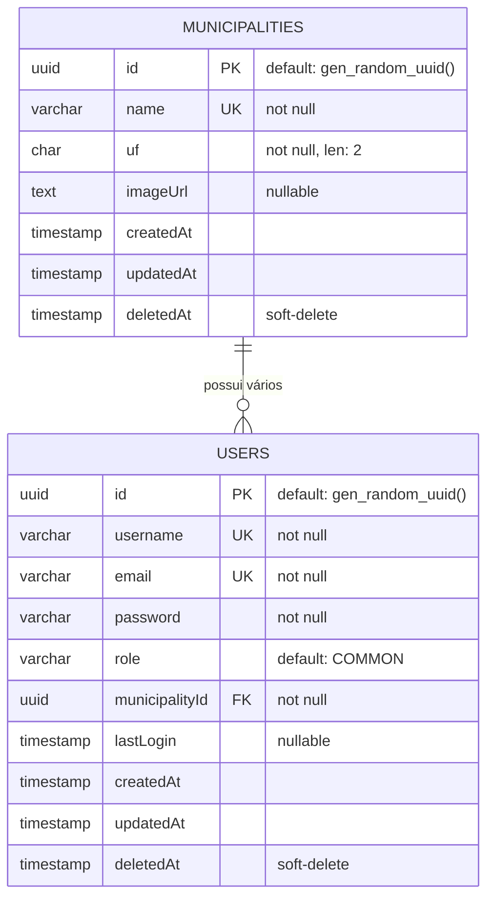

# 🚀 Roadmap do Backend - Docseq DMS

Este documento apresenta a análise do estado atual do backend da aplicação **Docseq DMS** (Document Management System) e define os próximos passos detalhados para o desenvolvimento contínuo da API.

---

## 🏗️ 1. Visão Geral da Arquitetura Atual

O projeto backend é desenvolvido em **Go (1.25)** utilizando o framework web **Gin Gonic** e o ORM **GORM** para persistência no banco de dados **PostgreSQL**.

A arquitetura segue uma estrutura inspirada em **Clean Architecture / DDD (Domain-Driven Design)** dividido em quatro camadas principais no diretório `internal/`:

```
backend/
├── cmd/
│   └── api/
│       └── main.go                 # Ponto de entrada (Inicialização e DI Manual)
├── internal/
│   ├── domain/                     # Entidades, DTOs e Interfaces (Regras de Negócio Corporativas)
│   ├── repository/                 # Implementação de persistência GORM (Interface com Banco)
│   ├── service/                    # Casos de uso e lógica de negócio
│   └── handler/                    # Camada de entrega HTTP (Controllers, Validação de entrada)
└── pkg/
    ├── database/                   # Inicialização do Pool de Conexões e AutoMigrations
    └── response/                   # Padronização de JSON Responses (Envelope Pattern)
```

### 📊 Modelo de Entidades Atual (GORM)



---

## 📈 2. Estado Atual de Implementação

Abaixo está o mapeamento dos componentes implementados para as entidades atuais do sistema:

| Módulo / Entidade | Domain | Repository | Service | Handler / API | Testes de Integração | Testes Unitários | Rotas no `main.go` |
| :--- | :---: | :---: | :---: | :---: | :---: | :---: | :---: |
| **Municípios (Municipalities)** | ✅ | ✅ | ✅ | ✅ | ✅ | ✅ | ✅ |
| **Usuários (Users)** | ✅ | ✅ | ✅ | ❌ | ✅ | ⚠️ | ❌ |

> [!IMPORTANT]
> **Lacuna Crítica:** O módulo de **Usuários** está incompleto. A camada de domínio, o repositório GORM e a camada de serviços estão completamente implementados e testados, porém não existem os controladores HTTP (handlers) e nem o registro de rotas no servidor.

---

## 🗺️ 3. Próximos Passos (Roadmap de Desenvolvimento)

Para evoluir o backend do **Docseq DMS** de forma consistente e segura, recomenda-se seguir o seguinte cronograma de tarefas:

### 🔹 Fase 1: Finalizar o Módulo de Usuários (CRUD)
Implementar as camadas em falta para o módulo de usuários com base nos padrões já estabelecidos para municípios.

1. **Service de Usuários (Concluído ✅):**
   - Criar o arquivo `internal/service/user_service.go` implementando a interface `domain.UserService` definida em [user.go](file:///home/nergal/apps/docSe9-DMS/backend/internal/domain/user.go).
   - Adicionar validações de negócio (ex: verificar se o e-mail ou nome de usuário já existem usando o repositório, garantir que o `MunicipalityID` informado pertença a um município existente e ativo).
   - Criar mocks para o repositório de usuários (`mocks.UserRepository`).
   - Criar testes unitários em `internal/service/user_service_test.go`.

2. **Handler de Usuários:**
   - Criar o arquivo `internal/handler/user_handler.go` expondo as seguintes rotas:
     - `POST /api/v1/users` (Criar usuário)
     - `GET /api/v1/users` (Listar usuários ativos - paginado)
     - `GET /api/v1/users/trash` (Listar usuários deletados)
     - `GET /api/v1/users/:id` (Buscar usuário por ID)
     - `PATCH /api/v1/users/:id` (Atualização parcial)
     - `DELETE /api/v1/users/:id` (Soft delete)
     - `PATCH /api/v1/users/:id/restore` (Restaurar da lixeira)
     - `DELETE /api/v1/users/:id/hard` (Hard delete definitivo)
   - Adicionar testes unitários em `internal/handler/user_handler_test.go` usando os mocks do Service.

3. **Fiação e Registro:**
   - Instanciar o `UserRepository`, `UserService` e `UserHandler` dentro de [main.go](file:///home/nergal/apps/docSe9-DMS/backend/cmd/api/main.go) e registrar as rotas de usuários no roteador Gin.

---

### 🔒 Fase 2: Segurança & Autenticação (JWT)
O OpenAPI em [openapi.yaml](file:///home/nergal/apps/docSe9-DMS/backend/openapi.yaml) prevê segurança por Token Bearer (JWT).

1. **Hashing de Senha Real:**
   - Atualmente, nos testes, as senhas de usuários são inseridas como texto puro (`hashed_password_123`). É necessário implementar criptografia real.
   - Adicionar o pacote `golang.org/x/crypto/bcrypt`.
   - Adicionar lógica de hash de senha no `UserService` antes de persistir no banco e lógica de validação durante o login.

2. **Endpoint de Autenticação:**
   - Criar endpoint `POST /api/v1/auth/login` recebendo email/username e senha.
   - Validar credenciais e emitir um token JWT com claims seguras (ex: `user_id`, `username`, `role`, `municipality_id`, expiração).
   - Atualizar a coluna `LastLogin` no banco de dados com a data/hora atual no momento do login.

3. **Middleware de Autenticação (`AuthMiddleware`):**
   - Criar um middleware Gin para interceptar requisições protegidas, extrair o cabeçalho `Authorization: Bearer <token>`, decodificar o JWT e injetar as informações do usuário autenticado no contexto do Gin (`c.Set("user", user)`).

4. **Autorização Baseada em Roles (RBAC):**
   - Utilizar a propriedade `Role` (`ADMIN` vs `COMMON`) para proteger rotas críticas. Por exemplo, apenas administradores (`RoleAdmin`) devem ter permissão para criar/atualizar/excluir municípios ou gerenciar outros usuários.

---

### 📂 Fase 3: Domínio de Gestão de Documentos (DMS Core)
Implementar as entidades de negócio principais do sistema.

1. **Modelagem de Domínio:**
   - Criar entidades `Folder` (Pastas para categorização lógica) e `Document` (Metadados dos arquivos).
   - Relacionar `Document` e `Folder` com `Municipality` (para multi-inquilinato / isolamento de dados) e com `User` (autor do upload).

2. **Upload e Armazenamento:**
   - Decidir a estratégia de armazenamento físico dos documentos:
     - *Local Storage:* Gravação em pasta específica no disco do servidor (bom para desenvolvimento local).
     - *Cloud Object Storage:* Integração via SDK com AWS S3 / MinIO (ideal para produção).
   - Criar serviço de Storage abstraído por interface para fácil substituição.

3. **Endpoints de Documentos:**
   - Upload de arquivos com validação de extensão, tamanho máximo e geração automática de hash/metadados.
   - Busca textual de documentos e filtragem por metadados (data de criação, autor, pasta).

---

### ⚙️ Fase 4: Qualidade, Documentação e Infraestrutura

1. **Geração Automatizada de Swagger:**
   - Instalar `swaggo/swag` para ler os comentários `@Summary` dos handlers e atualizar automaticamente o arquivo de especificação OpenAPI ou expor uma interface visual em `/swagger/*any`.

2. **Logs Estruturados:**
   - Substituir o pacote padrão de logs do Go por uma biblioteca estruturada de alta performance como o **Uber Zap** ou **Logrus**, facilitando a integração futura com ferramentas de APM (Datadog, Grafana Loki, etc.).

---

> [!TIP]
> **Dica de Execução dos Testes:**
> Sempre valide as alterações rodando a suite de testes local através do [Makefile](file:///home/nergal/apps/docSe9-DMS/backend/Makefile):
> - Testes unitários (sem docker): `make test-unit`
> - Testes de integração (com docker): `make test-integration`
